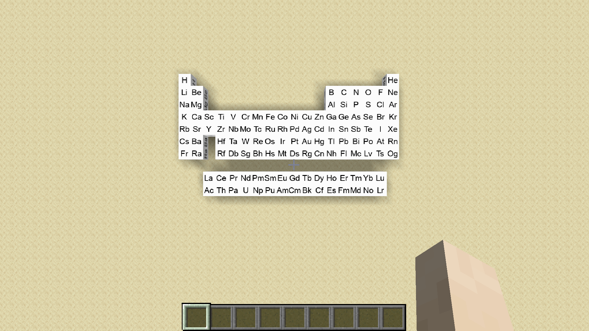

# Chemistry
This is a mod that adds elements into the game just like 
minecraft education version. It will also add some interaction
between chemicals and environment. It will also add some
reactions between different substances. 

## Current Elements
All 118 elements in the periodic table in a block form has been implemented. 
They have no use other than placing down and displaying them.
I do not plan to add any feature to these element blocks, and you cannot react with them.
They cannot be blown up, but they can be mined with an iron pickaxe with mining speed equal to a stone block.

## Current Substances
1. Hydrogen gas
2. Helium gas

## Current Reactions
I have not implemented any reaction into the mod yet.

I plan to add inorganic reactions only with some combustion reactions with organic compound.

## Versions
This mod is developed for minecraft 1.17.x using java 16. 
I plan to upgrade to minecraft 1.18.x using java 17 after
a stable release of minecraft 1.18. 

## Pictures

