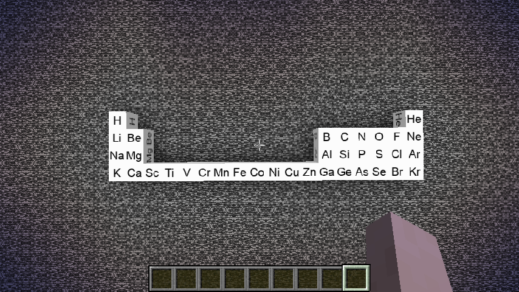

# Chemistry
This is a mod that adds elements into the game just like 
minecraft education version. It will also add some interaction
between chemicals and environment. It will also add some
reactions between different substances. 

## Current Elements
1-36, or the first 4 rows.

## Current Substances
1. Hydrogen gas
2. Helium gas

## Versions
This mod is developed for minecraft 1.17.x using java 16. 
I plan to upgrade to minecraft 1.18.x using java 17 after
a stable release of minecraft 1.18. 

## Pictures

