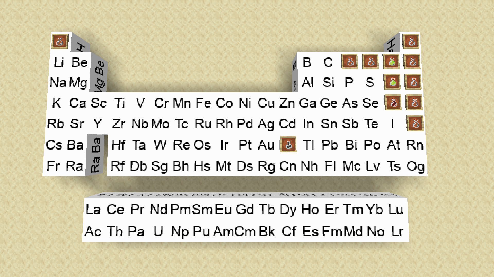

# Chemistry
This is a mod that adds elements into the game just like 
minecraft education version. It will also add some interaction
between chemicals and environment. It will also add some
reactions between different substances. 

## Current Elements
All 118 elements in the periodic table in a block form has been implemented. 
They have no use other than placing down and displaying them.
I do not plan to add any feature to these element blocks, and you cannot react with them.
They cannot be blown up, but they can be mined with an iron pickaxe with mining speed equal to a stone block.

## Current Substances
All the elemental gases and liquids have been added into the mod. 

I excluded last two nobel gases on purpose since I do not plan to add any radioactive substances at this point. Because of that, any element after Bismuth will not be added into the mod nor Technetium. I am aware that Bismuth is radioactive, but the half-life of that is way too long that I consider that non-radioactive.

## Current Reactions
I have not implemented any reaction into the mod yet.

I plan to add inorganic reactions only with some combustion reactions with organic compound.

## Versions
Minecraft 1.18.1 with java 17

## Pictures

